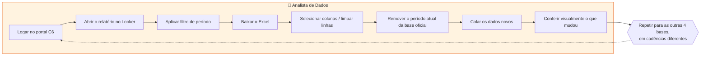
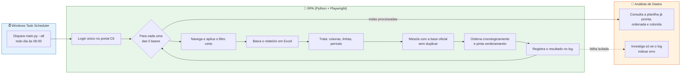
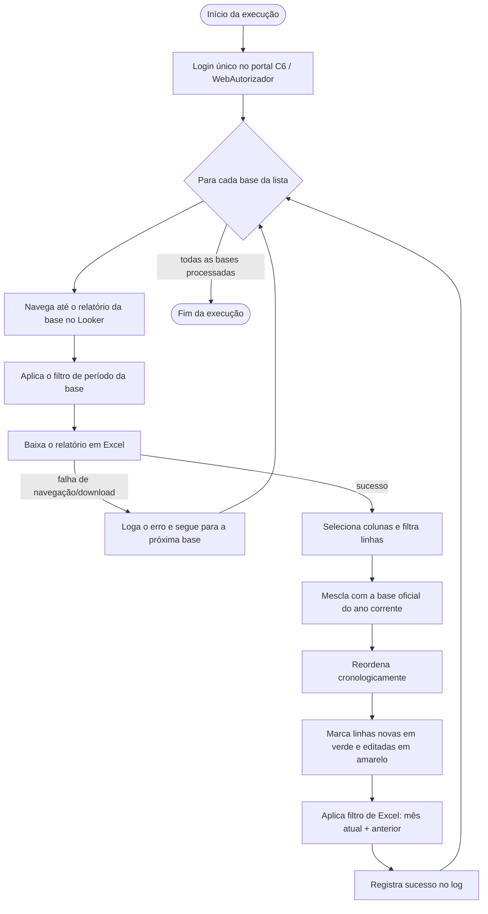

# 🤖 RPA — Bases C6 Veículos

> Automação de ponta a ponta — login, navegação, download, tratamento e
> consolidação — das bases usadas pelo time de Dados e Veículos (C6) no
> portal Looker/WebAutorizador.


---

## 📖 Sobre o projeto

Todo dia, alguém do time de Dados de Veículos precisava entrar manualmente
no Looker embutido no portal C6 Consig, navegar até cada relatório,
aplicar o filtro de período certo, baixar o Excel, limpar as colunas que
não interessavam e mesclar os dados novos na base oficial sem duplicar o
histórico — repetindo esse roteiro para **5 relatórios diferentes**, cada
um com sua própria navegação, filtro e cadência (diária, semanal ou
mensal).

Este projeto substitui esse roteiro por um robô (Python + Playwright) que
loga uma única vez no portal, navega até cada relatório, aplica o filtro
correto, baixa a planilha, trata os dados e atualiza tanto a "Prévia" da
execução quanto a base oficial — sempre ordenada cronologicamente e
marcada visualmente (verde/amarelo) para indicar o que mudou, sem
comparar planilha por planilha na mão.

---

## 🏢 Modelagem do processo de negócio

### Antes (processo manual)



- **5 relatórios**, cada um repetindo o mesmo roteiro de 8 passos.
- Tempo do analista consumido em tarefa repetitiva, sujeita a erro humano
  (filtro errado, esquecer de remover o período duplicado, baixar a base
  errada).
- Conferência do que mudou feita manualmente, comparando planilhas.

### Depois (processo automatizado)



- O analista deixa de executar o processo e passa a **consumir o
  resultado** — a planilha já chega tratada, ordenada e com o que mudou
  destacado em verde/amarelo.
- Falha em uma base não trava as demais; cada execução fica registrada em
  log, com sucesso/erro e quantidade de linhas alteradas.
- Histórico fechado (ano anterior) nunca é reescrito — só o ano corrente
  recebe atualização, dia após dia.

---

## 🎯 Objetivo

Automatizar, para cada uma das 5 bases, o ciclo completo:

**Acessar → Filtrar → Baixar → Tratar → Consolidar → Ordenar → Registrar**

| Etapa | O que acontece |
|---|---|
| **Acessar** | Login único no portal, reaproveitado para todas as bases da execução |
| **Filtrar** | Aplica o filtro de período específico de cada relatório no Looker |
| **Baixar** | Exporta o relatório em Excel |
| **Tratar** | Seleciona colunas, filtra linhas (ex: `Status Proposta`) |
| **Consolidar** | Mescla com a base oficial do ano corrente, sem duplicar |
| **Ordenar** | Reordena cronologicamente e marca em cor o que é novo/editado |
| **Registrar** | Grava um log detalhado de cada etapa em `logs/rpa.log` |

---

## 📊 Visão geral

| Indicador | Informação |
|---|---|
| Bases automatizadas | 5 (`meta_financiamento_seguro`, `numero_contratos`, `dias_sem_producao`, `carteira_parceiros`, `comissao_a_vista`) |
| Login no portal | Único por execução, reaproveitado entre as bases |
| Automação de navegador | Playwright (Chromium) |
| Tratamento de dados | pandas |
| Leitura/escrita/formatação Excel | openpyxl |
| Histórico por ano | Ano corrente incremental; ano fechado (ex: 2025) nunca é reescrito |
| Destino dos dados | Pastas locais (OneDrive) — nenhuma base usa SharePoint hoje |
| Agendamento | Windows Task Scheduler, diário às 06:00 (horário de Brasília) |
| Logging | Módulo `logging` nativo → console + `logs/rpa.log` |
| Resiliência | Falha em uma base não interrompe as demais |

---

## 🔄 Fluxo técnico da automação



O login acontece **uma única vez** por execução (`--all`/`--frequencia`
rodam várias bases seguidas sem logar de novo), e uma falha isolada — de
navegação, download ou tratamento — é registrada no log sem derrubar as
bases seguintes.

---

## 🧩 Arquitetura

```text
main.py  (CLI / orquestrador)
   │
   ├── looker_automation.py
   │       └── login único + navegação + filtros + download (Playwright)
   │
   ├── data_processor.py
   │       └── seleção de colunas, merge com a base oficial, ordenação
   │           cronológica, marcação de cores, filtro de mês no Excel
   │
   ├── backfill_ano_fechado.py
   │       └── script à parte para carga única de um ano fechado (histórico)
   │
   └── sharepoint_sync.py
           └── implementado no código, mas hoje NENHUMA das 5 bases o aciona
```

| Arquivo | Responsabilidade |
|---|---|
| [config.py](config.py) | Fonte única de verdade: caminho de menu no Looker, filtros, colunas a manter, chave de deduplicação, frequência e caminhos das pastas de cada base |
| [looker_automation.py](looker_automation.py) | Login, navegação por menus/popups e download de cada relatório (Playwright) |
| [data_processor.py](data_processor.py) | Limpeza, merge com a base oficial, ordenação, marcação de cor e filtro de mês (pandas + openpyxl) |
| [backfill_ano_fechado.py](backfill_ano_fechado.py) | Carga única de um ano fechado de histórico (ex: 2025), fora do fluxo diário normal |
| [sharepoint_sync.py](sharepoint_sync.py) | Download/upload via SharePoint — presente no código, não usado pelas 5 bases atuais |
| [main.py](main.py) | CLI (`--base` / `--all` / `--frequencia`) e orquestração do pipeline completo |

---

## 🗂️ Estrutura do projeto

```text
rpa_c6_veiculos/
├── config.py                # As 5 bases: caminho no Looker, filtros, colunas, pastas, frequência
├── looker_automation.py     # Login, navegação e download no Looker (Playwright)
├── data_processor.py        # Limpeza, merge, ordenação e marcação de cores (pandas)
├── backfill_ano_fechado.py  # Carga única de um ano fechado de histórico
├── sharepoint_sync.py       # Download/upload no SharePoint — não usado pelas 5 bases atuais
├── main.py                  # CLI / orquestrador
├── requirements.txt         # Dependências do projeto
├── .env.example             # Modelo de variáveis de ambiente
├── downloads/               # Arquivos baixados do Looker (gerada em runtime)
├── staging/                 # Bases originais durante o processamento via SharePoint (gerada em runtime)
├── logs/rpa.log             # Log de execução (gerada em runtime)
├── SETUP.md                 # Guia de instalação em um computador novo
└── GUIA_TIME_DADOS.md       # Guia de arquitetura, manutenção e como adicionar uma base
```

---

## 🚗 Bases automatizadas

| Base (`id`) | Frequência | Filtro no Looker | Chave única (deduplicação) | Status |
|---|---|---|---|---|
| Meta Financiamento e Seguro | Mensal | Safra Mês = ano corrente inteiro | `Anomes Apuracao` + `Filial` | ✅ Em operação |
| Número de Contratos | Diária | Dt Relatório = Year To Date | `ID Proposta` | ✅ Em operação |
| Dias sem Produção (SLA) | Semanal (segundas) | Referência Month = ano corrente inteiro | `Cd Loja` + `Safra Mes` | ✅ Em operação |
| Carteira e Parceiros | Diária | Referência = Este ano | `Cnpj Da Loja` + `Filial` + `Anomes` | ✅ Em operação |
| Comissão à Vista - Analítico | Mensal | Safra Mês = Este mês | `Cd Contrato` + `Anomes Apuracao` | ✅ Em operação |

Cada base grava sua planilha de origem oficial **por ano**
(`<Base> - {ano}.xlsx`). O ano corrente é atualizado a cada execução; um
ano fechado (ex: 2025) nunca é escrito de novo depois de carregado.

---

## ⚙️ Tecnologias

| Tecnologia | Responsabilidade no projeto |
|---|---|
| **Python 3.11+** | Linguagem principal de todo o robô |
| **Playwright** | Controla o navegador Chromium: login, hover/clique em menus, popups, filtros e download dos relatórios |
| **pandas** | Seleção de colunas, filtro de linhas, deduplicação, ordenação e merge entre a base baixada e a base oficial |
| **openpyxl** | Leitura/escrita de `.xlsx`, AutoFilter (incluindo o filtro de mês atual/anterior já ativado) e pintura das células (verde/amarelo) |
| **python-dotenv** | Carrega credenciais e caminhos de pasta do `.env`, sem expor nada no código |
| **holidays** | Calcula dias úteis (feriados nacionais + MG) para a regra de virada de mês de Meta Financiamento e Seguro |
| **Office365-REST-Python-Client** | Biblioteca usada por `sharepoint_sync.py`, hoje sem base ativa que a acione |
| **logging** (nativo) | Log estruturado de cada execução em console + `logs/rpa.log` |
| **Windows Task Scheduler** | Aciona `main.py` diariamente às 06:00 (configuração no SO, não no código) |

---

## 🧠 Regras de negócio

- **Login único por execução**: `looker_automation.download_bases` loga uma vez e reaproveita a mesma aba para todas as bases da chamada.
- **Nunca duplicar período**: a deduplicação por chave única garante que colar dados novos nunca duplique um registro já existente na base oficial.
- **Deduplicação por chave única**: cada base tem sua própria chave (tabela acima); ao concatenar dados novos e antigos, `drop_duplicates(..., keep="last")` mantém sempre a versão mais recente baixada.
- **Histórico por ano, ano corrente incremental**: cada base grava sua planilha oficial por ano. Um ano fechado (ex: 2025) é tratado como histórico congelado — a automação nunca escreve nele de novo; só o ano corrente recebe atualização a cada execução (`data_processor._eh_ano_corrente`).
- **Ordenação cronológica**: a cada execução, a planilha oficial do ano corrente é reordenada por data/período crescente — não só o bloco novo, a planilha inteira.
- **Filtro de mês já ativado no Excel**: as 5 planilhas oficiais do ano corrente abrem com um AutoFilter mostrando só o mês atual e o anterior (linhas de meses mais antigos ficam ocultas, não apagadas) — a janela rola sozinha com o tempo, sem manutenção manual.
- **Meta Financiamento e Seguro / Dias sem Produção — ano inteiro por execução**: em vez de buscar só o mês atual, essas duas bases buscam o ano corrente inteiro a cada execução, garantindo que qualquer dado adicionado ou editado em meses anteriores também seja capturado.
- **Meta Financiamento e Seguro — janela curta de Safra Mês na virada**: se hoje é dia 1 ou 2 do mês **e** o último dia do mês anterior não foi dia útil em MG, o comportamento de fechamento de mês é ajustado para não perder a apuração (`looker_automation.deve_usar_janela_curta_safra_mes`).
- **Carteira e Parceiros — mês atual sempre substituído por inteiro**: o mês em andamento é recalculado dia a dia pelo Looker, então é sempre removido e recolado inteiro na base oficial; meses fechados não são mais tocados.
- **Filtro de status**: apenas Número de Contratos filtra `Status Proposta = PROPOSTA PAGA` antes de seguir; as demais bases não têm esse filtro de linha.
- **Marcação de cor**: a cada execução, a chave única de cada base é comparada com a versão anterior — 🟩 verde para chave nova, 🟨 amarelo para chave existente com dado alterado, sem cor quando nada mudou.
- **Comissão à Vista — planilha de origem com linha de totais**: diferente das demais, essa planilha preserva uma linha de totais (soma/média) sempre recalculada e mantida como última linha, e uma linha existente é atualizada se algum dado mudar (não só ignorada).
- **Diálogo de sessão já ativa**: se o usuário já estiver logado em outro lugar, o portal abre um `confirm()` perguntando se quer continuar — o código aceita esse diálogo automaticamente.
- **Carga de histórico fechado**: [backfill_ano_fechado.py](backfill_ano_fechado.py) permite carregar um ano fechado específico (ex: 2025) para as bases que suportam essa carga — fora do fluxo diário/mensal normal, e só quando o Looker efetivamente tem esse histórico disponível.

---

## 🛡️ Tratamento de erros e resiliência

- **Isolamento entre bases**: uma exceção durante navegação, download ou tratamento de uma base é capturada, logada e a execução segue para a próxima base — nenhuma falha isolada interrompe `--all`/`--frequencia`.
- **Retry automático em toda base**: qualquer falha técnica/de navegação é tentada de novo automaticamente até `looker_automation.MAX_TENTATIVAS_POR_BASE` (2) vezes por base, antes de ser considerada "pulada". Um download com sucesso mas planilha vazia **não** entra nesse retry — é o comportamento esperado quando não há dados no período.
- **Retry em arquivo bloqueado**: se a planilha estiver aberta no Excel ou o OneDrive ainda estiver sincronizando, a gravação tenta de novo automaticamente por até ~2 minutos antes de falhar com uma mensagem clara.
- **Trava de execução única**: um arquivo de trava (criação atômica, sem condição de corrida) impede duas execuções simultâneas sobre os mesmos arquivos — importante porque a automação roda a partir de uma pasta sincronizada pelo OneDrive.
- **Perda da sessão principal**: se a aba logada do portal for fechada inesperadamente, a execução para as bases restantes daquela chamada e loga quais foram puladas.
- **Logging estruturado**: todo evento relevante (login, navegação, download, linhas novas/editadas, erros) é registrado com nível apropriado (`INFO`/`WARNING`/`ERROR`) em console e em `logs/rpa.log`.

---

## 🔐 Configuração e segurança

- Credenciais e caminhos ficam em variáveis de ambiente, carregadas via `python-dotenv` a partir de um arquivo `.env` — **nunca commitado** (está no `.gitignore`).
- [.env.example](.env.example) traz o modelo: `LOOKER_URL`, `LOOKER_USER`, `LOOKER_PASSWORD` são **obrigatórios**; as variáveis `SHAREPOINT_*` podem ficar em branco, pois nenhuma base ativa as usa hoje.
- Os caminhos das pastas "Prévia" e "origem oficial" de cada base podem ser sobrescritos por variáveis de ambiente (`PREVIA_*_DIR` / `PLANILHA_ORIGEM_*_DIR`), documentadas em detalhe no [SETUP.md](SETUP.md).
- Nenhuma credencial real é mantida neste README nem em nenhum arquivo versionado do repositório.

---

## 💻 Instalação

```bash
# 1. Clonar o repositório
git clone https://github.com/LeoUnica/RPA_c6_veiculos.git
cd RPA_c6_veiculos

# 2. Criar e ativar o ambiente virtual
python -m venv venv
venv\Scripts\activate          # Windows
source venv/bin/activate       # Mac/Linux

# 3. Instalar dependências
pip install -r requirements.txt
playwright install chromium

# 4. Configurar credenciais e caminhos
copy .env.example .env         # preencher com dados reais - ver SETUP.md
```

> ⚠️ Em um computador diferente do usado no desenvolvimento, os caminhos
> padrão de pasta em `config.py` não existirão. Siga o
> **[SETUP.md](SETUP.md)** — ele cobre a configuração obrigatória de
> caminhos por `.env` passo a passo.

---

## ▶️ Execução

```bash
# Uma base específica (ids: numero_contratos, dias_sem_producao,
# meta_financiamento_seguro, carteira_parceiros, comissao_a_vista)
python main.py --base numero_contratos

# Todas as 5 bases de uma vez
python main.py --all

# Todas as bases de uma frequência
python main.py --frequencia diaria
python main.py --frequencia semanal_segunda
python main.py --frequencia mensal

# Carga única de um ano fechado de histórico (ex: 2025)
python backfill_ano_fechado.py --base meta_financiamento_seguro --ano 2025

# Depuração visual de uma base isolada (abre o navegador em vez de headless)
python looker_automation.py --base numero_contratos --debug
```

| Comando | Quando usar |
|---|---|
| `--base <id>` | Testar/rodar uma única base isoladamente |
| `--all` | Rodar as 5 bases em sequência, com um único login (é o que o agendamento diário chama) |
| `--frequencia diaria \| semanal_segunda \| mensal` | Rodar só as bases daquela frequência |
| `backfill_ano_fechado.py` | Carregar uma única vez um ano fechado de histórico |
| `--debug` (em `looker_automation.py`) | Abrir o navegador visível para depurar a navegação passo a passo |

**Antes de rodar:** feche no Excel qualquer planilha (Prévia ou origem)
que a base for tocar — o pandas não consegue sobrescrever um `.xlsx`
aberto em outro programa.

---

## ⏰ Agendamento

O agendamento é feito **fora do código**, via **Windows Task Scheduler**:
uma tarefa diária, às **06:00 (horário de Brasília)**, dispara
`main.py --all` — as 5 bases rodam em sequência, com um único login.

Requisitos para a execução automática funcionar de fato todo dia:

- Máquina ligada (o modo de suspensão do Windows deve estar desabilitado —
  tela apagada/bloqueada não afeta a execução, mas o PC entrar em *sleep*
  interrompe tudo).
- Usuário com sessão aberta no Windows (a tarefa está configurada para
  rodar apenas quando o usuário estiver conectado).
- Conexão de rede disponível.

Passo a passo completo de configuração em
[SETUP.md](SETUP.md#7-agendamento-windows-task-scheduler).

---

## 📈 Benefícios da automação

- **Redução de trabalho manual repetitivo**: elimina o login, navegação, aplicação de filtro e download manual em 5 relatórios distintos, em diferentes cadências.
- **Padronização do processo**: filtros, colunas mantidas e regras de período ficam centralizados em `config.py`, em vez de dependerem da memória de quem executa.
- **Redução de erro operacional**: elimina riscos como aplicar o filtro errado, esquecer de remover o período duplicado, ou colar dados por cima da base errada.
- **Rastreabilidade**: cada execução fica registrada em `logs/rpa.log`, com sucesso, falhas e quantidade de linhas alteradas por base.
- **Conferência facilitada**: ordenação cronológica automática + marcação verde/amarelo mostram imediatamente o que é novo e o que mudou.
- **Continuidade garantida**: a falha de uma base não trava a atualização das demais.

---

## 🧪 Testes e validação

Antes de rodar `--all`/`--frequencia` em produção, ou após qualquer mudança de código:

1. Rodar uma base isolada: `python main.py --base <id>`.
2. Conferir o arquivo baixado em `downloads/`.
3. Conferir a Prévia gerada (cores, linhas, colunas esperadas).
4. Conferir se a base oficial foi mesclada e ordenada corretamente, sem duplicar.
5. Ler `logs/rpa.log` da execução em busca de `WARNING`/`ERROR`.
6. Se for mexer na navegação, usar `python looker_automation.py --base <id> --debug` para acompanhar visualmente antes de rodar o fluxo completo.

---

## 👥 Manutenção

Guia rápido para quem for dar continuidade ao projeto — o passo a passo
completo está no [GUIA_TIME_DADOS.md](GUIA_TIME_DADOS.md):

| Quero alterar... | Onde mexer |
|---|---|
| Filtro de uma base no Looker | `config.py` (dicionário da base em `BASES`) e a função de navegação correspondente em `looker_automation.py` |
| Colunas mantidas de uma base | `config.py` → `regras["colunas_manter"]` |
| Frequência de uma base | `config.py` → `frequencia` da base |
| Caminho de pasta (Prévia/origem) | Variável de ambiente `PREVIA_*_DIR` / `PLANILHA_ORIGEM_*_DIR` no `.env` |
| Regra de tratamento/merge de uma base | Função `_process_<base>` em `data_processor.py` |
| Adicionar uma base nova | Ver passo a passo no [GUIA_TIME_DADOS.md](GUIA_TIME_DADOS.md) |
| Investigar uma falha | `logs/rpa.log` |

---

## 📚 Documentação complementar

- **[SETUP.md](SETUP.md)** — guia de instalação em um computador novo: pré-requisitos, dependências, configuração de credenciais/caminhos, execução manual, agendamento e problemas conhecidos.
- **[GUIA_TIME_DADOS.md](GUIA_TIME_DADOS.md)** — guia de arquitetura para quem vai manter o projeto: como cada módulo funciona, marcação de cores, problemas conhecidos e como adicionar uma base nova.

---

## 👨‍💻 Autoria

Desenvolvido por **Leonardo Mudrik** para o setor de Dados e Veículos (C6).
