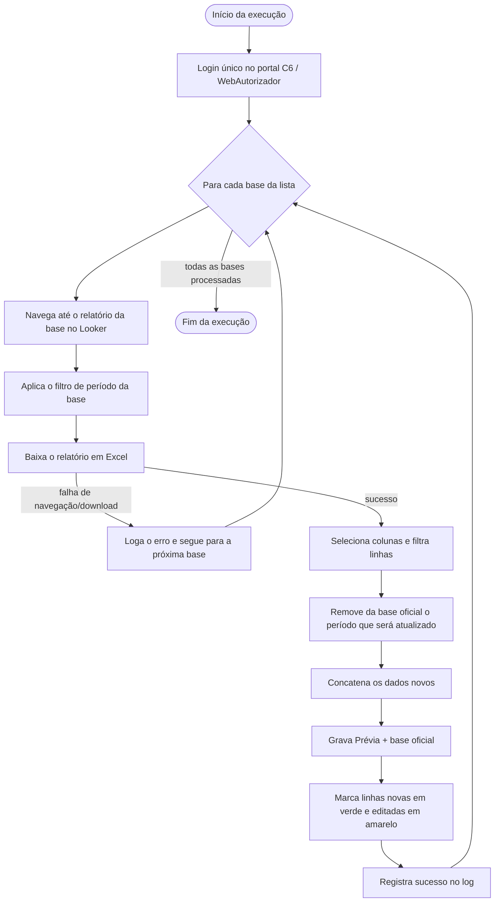

# 🤖 RPA — Bases C6 Veículos

> Automação de ponta a ponta — login, navegação, download, tratamento e
> consolidação — das bases usadas pelo time de Dados e Veículos (C6) no
> portal Looker/WebAutorizador.


---

## 📖 Sobre o projeto

Toda semana, alguém do time de dados de Veículos entrava manualmente no
Looker embutido no portal C6 Consig, navegava até o relatório certo,
aplicava um filtro de período, baixava o Excel, limpava as colunas que não
interessavam, apagava do histórico oficial os dados do mês/ano corrente
(para não duplicar) e colava os dados novos por cima. Esse roteiro se
repetia para **4 bases diferentes**, cada uma com sua própria navegação,
seus próprios filtros e sua própria regra de qual período contava como
"atual" — algumas diariamente, outras semanalmente, outra mensalmente.

Este projeto reproduz esse roteiro inteiro em código: um robô controla um
navegador real (Playwright), loga **uma única vez** no portal, navega até
cada relatório, aplica o filtro correto, baixa a planilha, trata os dados
(seleciona colunas, filtra linhas) e atualiza tanto a planilha "Prévia" da
execução quanto a base oficial que acumula o histórico — removendo o
período atual antes de colar os dados novos, para nunca duplicar. Ao final,
a Prévia é marcada visualmente (verde/amarelo) para quem for conferir saber
exatamente o que mudou naquela execução, sem comparar planilha por planilha
na mão.

**Resultado:** o que era um procedimento manual, repetitivo e sujeito a
esquecimento (aplicar o filtro errado, esquecer de remover o período
duplicado, baixar a base errada) passa a rodar de forma padronizada, com
log de cada execução e sem depender de uma pessoa lembrar dos passos.

---

## 🎯 Objetivo

Automatizar, para cada uma das 5 bases, o ciclo completo:

**Acessar → Filtrar → Baixar → Tratar → Consolidar → Atualizar → Registrar**

- **Acessar**: login único no portal, reaproveitado para todas as bases da execução.
- **Filtrar**: aplica o filtro de período específico de cada relatório no Looker.
- **Baixar**: exporta o relatório em Excel.
- **Tratar**: seleciona colunas, filtra linhas (ex: `Status Proposta`), remove o que não é do período atual.
- **Consolidar**: mescla com a base oficial sem duplicar o período já existente.
- **Atualizar**: grava a planilha "Prévia" e a planilha de origem oficial, com marcação de cor do que mudou.
- **Registrar**: grava um log detalhado de cada etapa, sucesso ou falha, em `logs/rpa.log`.

---

## 📊 Visão geral

| Indicador | Informação |
|---|---|
| Bases automatizadas | 5 (`meta_financiamento_seguro`, `numero_contratos`, `dias_sem_producao`, `carteira_parceiros`, `comissao_a_vista`) |
| Login no portal | Único por execução, reaproveitado entre as bases |
| Automação de navegador | Playwright (Chromium) |
| Tratamento de dados | pandas |
| Leitura/escrita/formatação Excel | openpyxl |
| Destino dos dados | Pastas locais (normalmente OneDrive) — nenhuma base usa SharePoint hoje |
| Agendamento | Windows Task Scheduler (configurado no SO, fora do código) |
| Logging | módulo `logging` nativo → console + `logs/rpa.log` |
| Resiliência | Falha em uma base não interrompe as demais |

---

## 🔄 Fluxo da automação



O login acontece **uma única vez** por execução (`--all`/`--frequencia`
rodam várias bases seguidas sem logar de novo), e uma falha isolada — de
navegação, download ou tratamento — é registrada no log sem derrubar as
bases seguintes.

---

## 🧩 Arquitetura

```text
main.py  (CLI / orquestrador)
   │
   ├── looker_automation.py
   │       └── login único + navegação + filtros + download (Playwright)
   │
   ├── data_processor.py
   │       └── seleção de colunas, filtros de linha, remoção de período
   │           duplicado, merge com a base oficial, marcação de cores
   │
   └── sharepoint_sync.py
           └── implementado no código, mas hoje NENHUMA das 5 bases o aciona
               (todas usam modo "planilha_origem_local*", ver seção Config)
```

| Arquivo | Responsabilidade |
|---|---|
| [config.py](config.py) | Fonte única de verdade: caminho de menu no Looker, filtros, colunas a manter, chave de deduplicação (via `modo`), frequência e caminhos das pastas de cada base |
| [looker_automation.py](looker_automation.py) | Login, navegação por menus/popups e download de cada relatório (Playwright) |
| [data_processor.py](data_processor.py) | Limpeza, filtros, merge com a base oficial e marcação de cor (pandas + openpyxl) |
| [sharepoint_sync.py](sharepoint_sync.py) | Download/upload via SharePoint (Office365-REST-Python-Client) — presente no código, não usado pelas 5 bases atuais |
| [main.py](main.py) | CLI (`--base` / `--all` / `--frequencia`) e orquestração do pipeline completo |

---

## 🗂️ Estrutura do projeto

```text
rpa_c6_veiculos/
├── config.py              # As 5 bases: caminho no Looker, filtros, colunas, pastas, frequência
├── looker_automation.py   # Login, navegação e download no Looker (Playwright)
├── data_processor.py      # Limpeza, filtro, merge e marcação de cores (pandas)
├── sharepoint_sync.py     # Download/upload no SharePoint — não usado pelas 5 bases atuais
├── main.py                # CLI / orquestrador
├── requirements.txt       # Dependências do projeto
├── .env.example           # Modelo de variáveis de ambiente
├── downloads/              # Arquivos baixados do Looker (gerada em runtime)
├── staging/                # Bases originais durante o processamento via SharePoint (gerada em runtime, não usada pelas 5 bases atuais)
├── logs/rpa.log            # Log de execução (gerada em runtime)
├── SETUP.md                # Guia de instalação em um computador novo
└── GUIA_TIME_DADOS.md       # Guia de arquitetura, manutenção e como adicionar uma base
```

---

## 🚗 Bases automatizadas

| Base (`id`) | Frequência | Filtro no Looker | Chave única (deduplicação) | Status |
|---|---|---|---|---|
| Meta Financiamento e Seguro | Mensal | Safra Mês = Este mês *(janela de 3 dias na virada, ver regras de negócio)* | `Anomes Apuracao` + `Filial` | ✅ Em operação |
| Número de Contratos | Diária | Dt Relatório = Last 30 Days *(tratamento restringe ao mês atual)* | `ID Proposta` | ✅ Em operação |
| Dias sem Produção (SLA) | Semanal (segundas) | Referência Month = Este mês | `Cd Loja` + `Safra Mes` | ✅ Em operação |
| Carteira e Parceiros | Diária | Referência = Este ano | `Cnpj Da Loja` + `Filial` + `Anomes` | ✅ Em operação |
| Comissão à Vista - Analítico | Mensal | Safra Mês = Este mês *(mesmo mês/ano do relatório Analítico, ver Regras de negócio)* | `Cd Contrato` + `Anomes Apuracao` | ✅ Em operação |

---

## ⚙️ Tecnologias

| Tecnologia | Responsabilidade no projeto |
|---|---|
| **Python 3.11+** | Linguagem principal de todo o robô |
| **Playwright** | Controla o navegador Chromium: login, hover/clique em menus, popups, filtros e download dos relatórios |
| **pandas** | Seleção de colunas, filtro de linhas, deduplicação e merge entre a base baixada e a base oficial |
| **openpyxl** | Leitura/escrita de `.xlsx`, aplicação de AutoFilter e pintura das células (verde/amarelo) |
| **python-dotenv** | Carrega credenciais e caminhos de pasta do `.env`, sem expor nada no código |
| **holidays** | Calcula dias úteis (feriados nacionais + MG) para a regra de virada de mês de Meta Financiamento e Seguro |
| **Office365-REST-Python-Client** | Biblioteca usada por `sharepoint_sync.py`, hoje sem base ativa que a acione |
| **logging** (nativo) | Log estruturado de cada execução em console + `logs/rpa.log` |
| **Windows Task Scheduler** | Aciona `main.py --frequencia ...` nos horários definidos (configuração no SO, não no código) |

---

## 🧠 Regras de negócio

- **Login único por execução**: `looker_automation.download_bases` loga uma vez e reaproveita a mesma aba para todas as bases da chamada — não há logout/login entre bases.
- **Nunca duplicar período**: antes de colar dados novos na base oficial, o período correspondente (mês, para a maioria; ano corrente inteiro, para Carteira e Parceiros) é removido primeiro.
- **Deduplicação por chave única**: cada base tem sua própria chave (tabela acima); ao concatenar dados novos e antigos, `drop_duplicates(..., keep="last")` mantém sempre a versão mais recente baixada.
- **Número de Contratos — janela de virada de mês**: o relatório usa "Last 30 Days", então o tratamento restringe às linhas do mês atual; no dia 1 do mês, mantém também os últimos 3 dias do mês anterior, pois alguns contratos só aparecem como `PROPOSTA PAGA` com atraso.
- **Meta Financiamento e Seguro — janela curta de Safra Mês**: se hoje é dia 1 ou 2 do mês **e** o último dia do mês anterior não foi dia útil em MG (fim de semana ou feriado, via biblioteca `holidays`), o filtro no Looker muda de "este mês" para "últimos 3 dias", para não perder a apuração de fechamento do mês anterior (`looker_automation.deve_usar_janela_curta_safra_mes`).
- **Carteira e Parceiros — mês atual sempre substituído por inteiro**: diferente das demais, o mês em andamento é recalculado dia a dia pelo Looker, então ele é sempre removido e recolado inteiro na base oficial (não só "linhas novas"); meses fechados não são mais tocados.
- **Filtro de status**: apenas Número de Contratos filtra `Status Proposta = PROPOSTA PAGA` antes de seguir; as demais bases não têm esse filtro de linha.
- **Marcação de cor na Prévia**: a cada execução, a Prévia recém-gerada é comparada com a versão anterior pela chave única de cada base — 🟩 verde para chave nova, 🟨 amarelo para chave existente com algum dado alterado, sem cor quando nada mudou. Colunas numéricas são arredondadas a 6 casas decimais e células vazias recebem um marcador fixo antes da comparação, para evitar falsos "editada" causados por perda de precisão do Excel ou por `NaN != NaN`. Essa marcação existe só na Prévia — a base oficial não é colorida.
- **Diálogo de sessão já ativa**: se o usuário já estiver logado em outro lugar, o portal abre um `confirm()` perguntando se quer continuar — o código aceita esse diálogo automaticamente (`page.on("dialog", ...)`).
- **Comissão à Vista — duas planilhas, regras diferentes**: a Prévia funciona exatamente como as outras 4 bases (reescrita e cor recalculada a cada execução - 🟩 verde para chave nova, 🟨 amarelo para chave existente com dado alterado). Já a planilha de origem oficial (que já vinha com meses anteriores mantidos pelo time antes desta base existir no RPA) nunca é reescrita nem colorida - só recebe registros com chave genuinamente nova, anexados no final; uma chave já existente não é atualizada mesmo que algum dado tenha mudado no download (chave: `Cd Contrato` + `Anomes Apuracao`).
- **Comissão à Vista — mesmo período do relatório Analítico**: o filtro "Safra Mês" precisa refletir o mesmo mês/ano usado por Número de Contratos. Como os dois derivam do mesmo mês/ano corrente do sistema (centralizado em `config.periodo_referencia_atual`), isso vale automaticamente contanto que ambas as bases rodem dentro do mesmo mês civil.
- **Comissão à Vista — nomes de coluna com espaços do Looker**: pelo menos uma coluna do relatório baixado vem com espaços/quebra de linha ao redor do nome (ex: `"\n    R$ Comissão À Vista Bruto - Master\n    "`); os nomes de coluna são sempre limpos (`str.strip()`) antes de comparar com a planilha existente, para não tratar como coluna nova/diferente e perder dados.

---

## 🛡️ Tratamento de erros e resiliência

- **Isolamento entre bases**: uma exceção durante navegação, download ou tratamento de uma base é capturada, logada (`logger.exception`) e a execução segue para a próxima base da lista — nenhuma falha isolada interrompe `--all`/`--frequencia`.
- **Limpeza de abas após falha**: se uma base falhar antes de fechar sua própria aba/popup, o `download_bases` fecha qualquer aba nova ainda aberta ao final daquela base, para não "sujar" a sessão da próxima.
- **Perda da sessão principal**: se a aba logada do portal for fechada inesperadamente (ex: crash do navegador), a execução para as bases restantes daquela chamada e loga quais foram puladas, em vez de deixar cada uma falhar de forma confusa.
- **Retry automático em toda base**: qualquer falha técnica/de navegação é tentada de novo automaticamente, reabrindo a navegação do zero, até `looker_automation.MAX_TENTATIVAS_POR_BASE` (2) vezes por base antes de ser considerada "pulada" e a execução seguir para a próxima. Um download com sucesso mas planilha vazia **não** entra nesse retry — isso não é tratado como falha, só é logado e a execução segue em frente normalmente (é o comportamento esperado quando não há dados no período).
- **Falha conhecida — Dias sem Produção (SLA)**: apresenta timeout intermitente esperando a tabela carregar após aplicar o filtro (o retry automático acima existe especialmente por causa dela). Se falhar mesmo após todas as tentativas, o log registra explicitamente que **é uma falha técnica de navegação/carregamento, não ausência de dados** para o período — a causa raiz ainda está sob investigação.
- **Comissão à Vista validada em 17/08/2026**: navegação, filtro, download e o merge com a planilha de origem oficial real (6 meses de histórico) foram testados de ponta a ponta contra o portal - ver `looker_automation.py` e `data_processor._process_comissao_a_vista` para as notas de validação.
- **Logging estruturado**: todo evento relevante (login, navegação, download, quantidade de linhas novas/removidas, erros) é registrado com nível apropriado (`INFO`/`WARNING`/`ERROR`) em console e em `logs/rpa.log`, com data e hora.

---

## 🔐 Configuração e segurança

- Credenciais e caminhos ficam em variáveis de ambiente, carregadas via `python-dotenv` a partir de um arquivo `.env` — **nunca commitado** (está no `.gitignore`).
- [.env.example](.env.example) traz o modelo: `LOOKER_URL`, `LOOKER_USER`, `LOOKER_PASSWORD` são **obrigatórios**; as variáveis `SHAREPOINT_*` podem ficar em branco, pois nenhuma base ativa as usa hoje.
- Os caminhos das pastas "Prévia" e "origem oficial" de cada base têm um valor padrão fixo em `config.py` (aponta para o computador onde o projeto foi desenvolvido) e podem — devem, em outra máquina — ser sobrescritos por 10 variáveis de ambiente (`PREVIA_*_DIR` / `PLANILHA_ORIGEM_*_DIR`, 2 por base), documentadas em detalhe no [SETUP.md](SETUP.md).
- Nenhuma credencial real é mantida neste README nem em nenhum arquivo versionado do repositório.

---

## 💻 Instalação

```bash
# 1. Clonar o repositório
git clone https://github.com/LeoUnica/RPA_c6_veiculos.git
cd RPA_c6_veiculos

# 2. Criar e ativar o ambiente virtual
python -m venv venv
venv\Scripts\activate          # Windows
source venv/bin/activate       # Mac/Linux

# 3. Instalar dependências
pip install -r requirements.txt
playwright install chromium

# 4. Configurar credenciais e caminhos
copy .env.example .env         # preencher com dados reais - ver SETUP.md
```

> ⚠️ Em um computador diferente do usado no desenvolvimento, os caminhos
> padrão de pasta em `config.py` (`Desktop\C6 Bank\...`) não existirão.
> Siga o **[SETUP.md](SETUP.md)** — ele cobre a configuração obrigatória de
> caminhos por `.env` passo a passo.

---

## ▶️ Execução

```bash
# Uma base específica (ids: numero_contratos, dias_sem_producao,
# meta_financiamento_seguro, carteira_parceiros, comissao_a_vista)
python main.py --base numero_contratos

# Todas as 5 bases de uma vez
python main.py --all

# Todas as bases de uma frequência (uso típico em agendamento)
python main.py --frequencia diaria
python main.py --frequencia semanal_segunda
python main.py --frequencia mensal

# Depuração visual de uma base isolada (abre o navegador em vez de headless)
python looker_automation.py --base numero_contratos --debug
```

| Comando | Quando usar |
|---|---|
| `--base <id>` | Testar/rodar uma única base isoladamente |
| `--all` | Rodar as 5 bases em sequência, com um único login |
| `--frequencia diaria \| semanal_segunda \| mensal` | Rodar só as bases daquela frequência — é o que o agendamento chama |
| `--debug` (em `looker_automation.py`) | Abrir o navegador visível para depurar a navegação passo a passo |

**Antes de rodar:** feche no Excel qualquer planilha (Prévia ou origem) que
a base for tocar — o pandas não consegue sobrescrever um `.xlsx` aberto em
outro programa e a execução falha com `PermissionError`.

---

## ⏰ Agendamento

O agendamento automático é feito **fora do código**, via **Windows Task
Scheduler** (não há nenhuma automação de criação de tarefa no repositório).
Cada base já tem sua frequência definida em `config.py`:

| Base | Frequência |
|---|---|
| Número de Contratos | Diária |
| Carteira e Parceiros | Diária |
| Dias sem Produção | Semanal (segundas-feiras) |
| Meta Financiamento e Seguro | Mensal |
| Comissão à Vista - Analítico | Mensal |

Para configurar, criar uma tarefa por frequência no Task Scheduler apontando:

- **Programa/script**: `C:\caminho\para\RPA_c6_veiculos\venv\Scripts\python.exe`
- **Argumentos**: `main.py --frequencia diaria` (repetir para `semanal_segunda` e `mensal`)
- **Iniciar em**: `C:\caminho\para\RPA_c6_veiculos`

Passo a passo completo em [SETUP.md](SETUP.md#7-agendamento-windows-task-scheduler).

---

## 📈 Benefícios da automação

- **Redução de trabalho manual repetitivo**: elimina o login, navegação, aplicação de filtro e download manual em 4 relatórios distintos, em diferentes cadências.
- **Padronização do processo**: os filtros, colunas mantidas e regras de período ficam centralizados em `config.py`, em vez de dependerem da memória de quem executa.
- **Redução de erro operacional**: elimina riscos como aplicar o filtro errado, esquecer de remover o período duplicado, ou colar dados por cima da base errada.
- **Rastreabilidade**: cada execução fica registrada em `logs/rpa.log`, com sucesso, falhas e quantidade de linhas alteradas por base.
- **Conferência facilitada**: a marcação verde/amarelo na Prévia mostra imediatamente o que é novo e o que mudou, sem precisar comparar planilhas manualmente.
- **Continuidade garantida**: a falha de uma base (ex: SLA) não trava a atualização das demais.

---

## 🧪 Testes e validação

Antes de rodar `--all`/`--frequencia` em produção, ou após qualquer mudança de código:

1. Rodar uma base isolada: `python main.py --base <id>`.
2. Conferir o arquivo baixado em `downloads/`.
3. Conferir a Prévia gerada (cores, linhas, colunas esperadas).
4. Conferir se a base oficial foi mesclada corretamente (sem duplicar o período atual).
5. Ler `logs/rpa.log` da execução em busca de `WARNING`/`ERROR`.
6. Se for mexer na navegação, usar `python looker_automation.py --base <id> --debug` para acompanhar visualmente antes de rodar o fluxo completo.

---

## 👥 Manutenção

Guia rápido para quem for dar continuidade ao projeto — o passo a passo
completo, com exemplos, está no [GUIA_TIME_DADOS.md](GUIA_TIME_DADOS.md):

| Quero alterar... | Onde mexer |
|---|---|
| Filtro de uma base no Looker | `config.py`, dicionário da base em `BASES`, e a função de navegação correspondente em `looker_automation.py` |
| Colunas mantidas de uma base | `config.py` → `regras["colunas_manter"]` |
| Frequência de uma base | `config.py` → `regras`/`frequencia` da base |
| Caminho de pasta (Prévia/origem) | Variável de ambiente `PREVIA_*_DIR` / `PLANILHA_ORIGEM_*_DIR` no `.env` (não editar `config.py` diretamente) |
| Regra de tratamento/merge de uma base | Função `_process_<base>` em `data_processor.py` |
| Adicionar uma base nova | Ver passo a passo na seção 11 do [GUIA_TIME_DADOS.md](GUIA_TIME_DADOS.md) — adicionar em `config.py`, `looker_automation.py` e `data_processor.py` |
| Investigar uma falha | `logs/rpa.log` |

---

## 📚 Documentação complementar

- **[SETUP.md](SETUP.md)** — guia de instalação em um computador novo: pré-requisitos, dependências, configuração de credenciais/caminhos, execução manual, agendamento e problemas conhecidos.
- **[GUIA_TIME_DADOS.md](GUIA_TIME_DADOS.md)** — guia de arquitetura para quem vai manter o projeto: como cada módulo funciona, marcação de cores, problemas conhecidos e como adicionar uma base nova.

---

## 👨‍💻 Autoria

Desenvolvido por **Leonardo Mudrik** para o setor de Dados e Veículos (C6).
